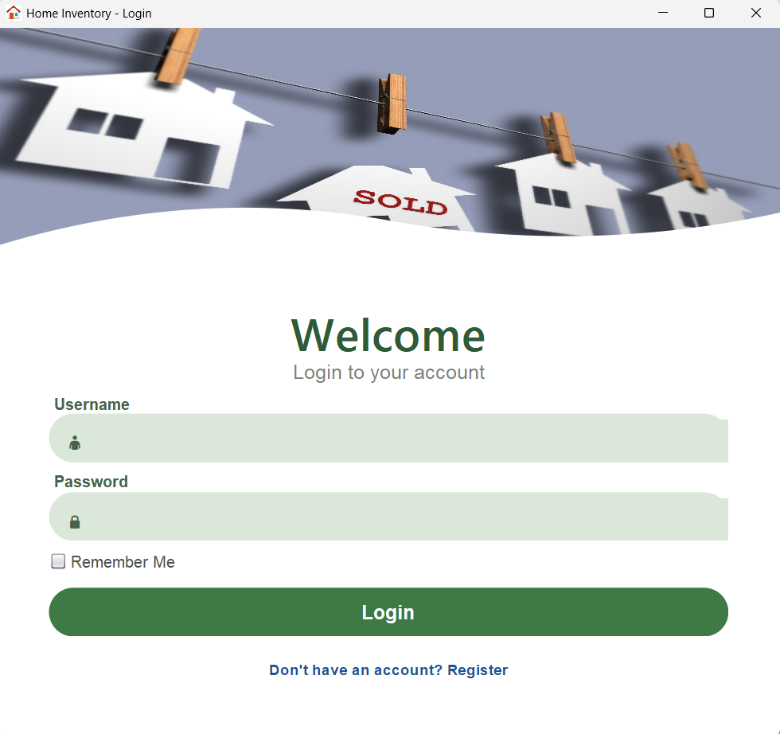
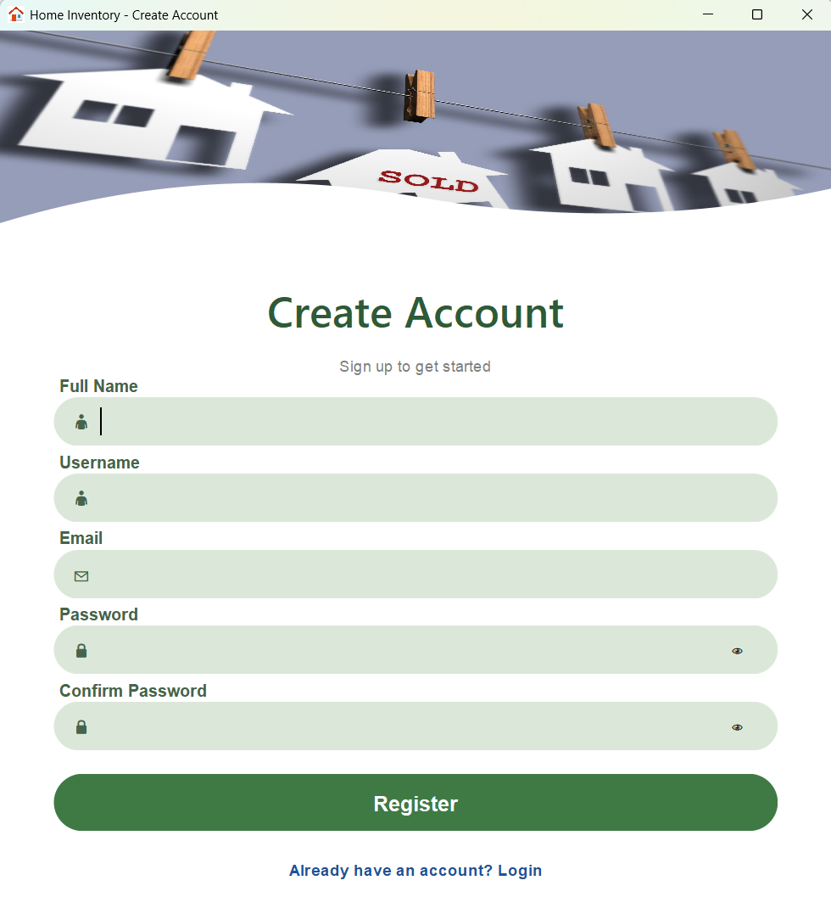
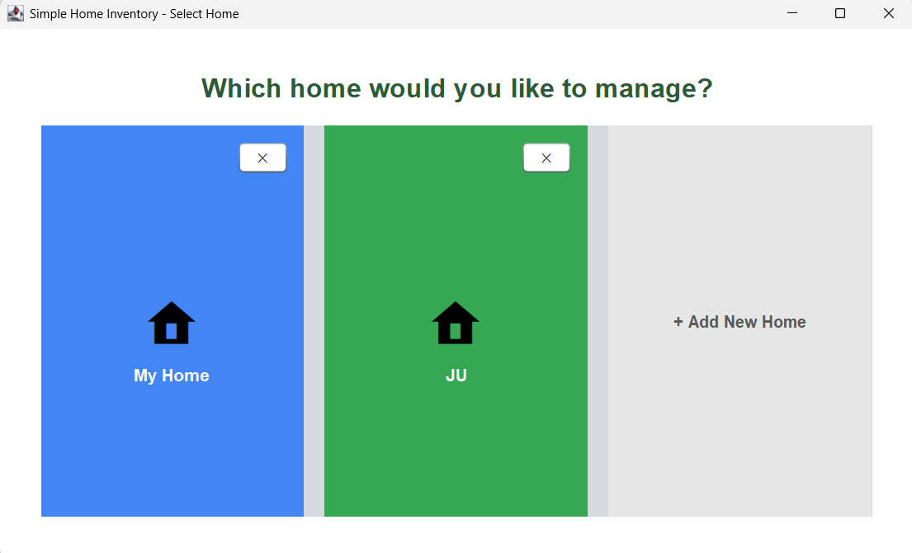
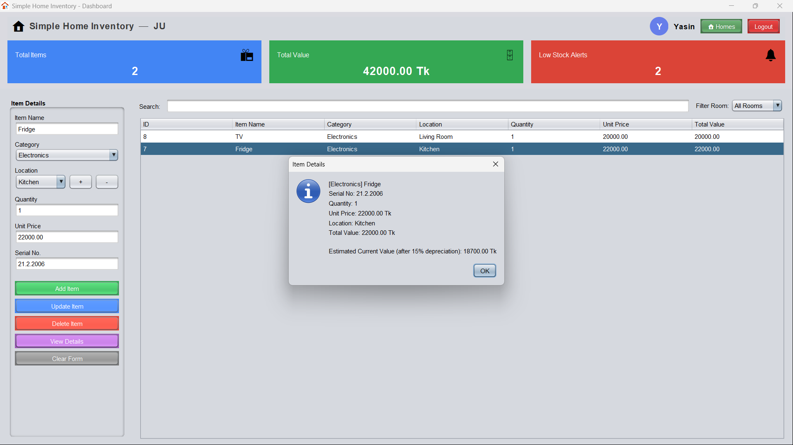

# 🏠 Home Inventory Management System

A Java-based **Home Inventory Management System** designed to help users organize, manage, and track household items efficiently through a simple desktop application.

This project was developed using **Java and Object-Oriented Programming (OOP)** principles. It provides user authentication, inventory management, item categorization, and persistent data storage using **text files**.

---

## 📌 About the Project

Managing household items manually can become difficult as the number of items increases. The **Home Inventory Management System** provides a simple and organized way to store and manage information about household belongings.

The application allows users to register and log in, access the main dashboard, manage inventory items, and keep application data stored locally through text files.

---

## ✨ Features

### 🔐 User Authentication

* User registration
* User login
* Basic authentication flow
* User data storage using text files

### 📦 Inventory Management

* Add household items
* View inventory information
* Manage existing items
* Update item information
* Delete items
* Organize items by category

### 🏠 Item Categories

The system supports different categories of household items, including:

* Electronic Items
* Furniture Items
* General Items
* Other household inventory items

### 💾 File-Based Data Storage

Instead of using a database, this version of the project stores application data in **text files**.

This approach keeps the project lightweight and easy to run without requiring a separate database setup.

### 🖥️ Desktop GUI

The application includes a Java Swing-based graphical interface with:

* Login screen
* Registration screen
* Main dashboard
* Inventory management interface
* Custom buttons and input components

---

## 🛠️ Technologies Used

| Technology                      | Purpose                      |
| ------------------------------- | ---------------------------- |
| **Java**                        | Application development      |
| **Java Swing**                  | Graphical User Interface     |
| **Object-Oriented Programming** | Application design           |
| **Apache NetBeans**             | Development environment      |
| **Apache Ant**                  | Build and project management |
| **Text Files**                  | Local data persistence       |
| **Git & GitHub**                | Version control              |

---

## 🧠 OOP Concepts Used

This project demonstrates several fundamental Object-Oriented Programming concepts.

### Encapsulation

Data and related methods are organized within classes with controlled access to internal information.

### Inheritance

Different types of inventory items can be represented using specialized classes based on common item functionality.

### Polymorphism

Common inventory structures can work with different item types while allowing specialized implementations.

### Abstraction

Common behavior and data structures are separated from specific implementations to keep the system organized.

### Classes and Objects

The application is divided into multiple classes representing inventory items, users, GUI components, and supporting functionality.

### Constructors and Methods

Constructors are used to initialize objects, while methods handle application operations and user interactions.

---

## 🏗️ Application Flow

```text
Register
   ↓
Login
   ↓
Main Dashboard
   ↓
Inventory Management
   ↓
Add / View / Update / Delete Items
   ↓
Save Data to Text Files
```

---

## 📂 Project Structure

```text
HomeInventory/
│
├── src/
│   └── ...
│
├── nbproject/
├── build.xml
├── manifest.mf
├── README.md
└── data/
    └── *.txt

## 💾 Data Storage

The current version uses **text files instead of SQLite** for storing application data.

For example, information can be stored in structured text files such as:

```text
users.txt
inventory.txt
electronics.txt
furniture.txt
general.txt
```

This makes the project:

* Lightweight
* Easy to configure
* Easy to run locally
* Independent of a database server
* Suitable for an educational Java project

---

## 🚀 Getting Started

### Prerequisites

Make sure the following are installed:

* **Java JDK**
* **Apache NetBeans**
* **Git** (optional, for cloning the repository)

---

## 📥 Clone the Repository

```bash
git clone https://github.com/yasin-hasan18/HomeInventory.git
```

Then open the project folder in **Apache NetBeans**.

---

## ▶️ How to Run

1. Clone or download the repository.
2. Open **Apache NetBeans**.
3. Select **File → Open Project**.
4. Choose the `HomeInventory` project folder.
5. Build the project.
6. Run the application.
7. Register a user and log in to access the system.

---

## 🖼️ Screenshots


### Login Screen



### Registration Screen



### Home Dashboard



### Inventory Management



---

## 🎯 Project Objectives

The main objectives of this project are:

* To develop a practical Java desktop application
* To apply Object-Oriented Programming concepts
* To practice Java Swing GUI development
* To implement file-based data persistence
* To build a structured inventory management system
* To improve Java programming and software development skills

---

## 🔮 Future Improvements

Possible future improvements include:

* Database integration
* Advanced search and filtering
* Inventory statistics and analytics
* Low-stock notifications
* Export data to Excel, CSV, or PDF
* Improved authentication and security
* Password encryption
* Backup and restore functionality
* Modern and responsive user interface
* Cloud-based data synchronization

---

## 📌 Project Status

**Status:** Academic / Educational Project

The project is actively developed as a Java-based desktop inventory management application. The current version uses local text-file storage for data persistence.

---

## 👨‍💻 Author

**Yasin Hasan**

GitHub:
https://github.com/yasin-hasan18<br>

Repository:
https://github.com/yasin-hasan18/HomeInventory

---

## 📄 License

This project was developed for **educational purposes**.
